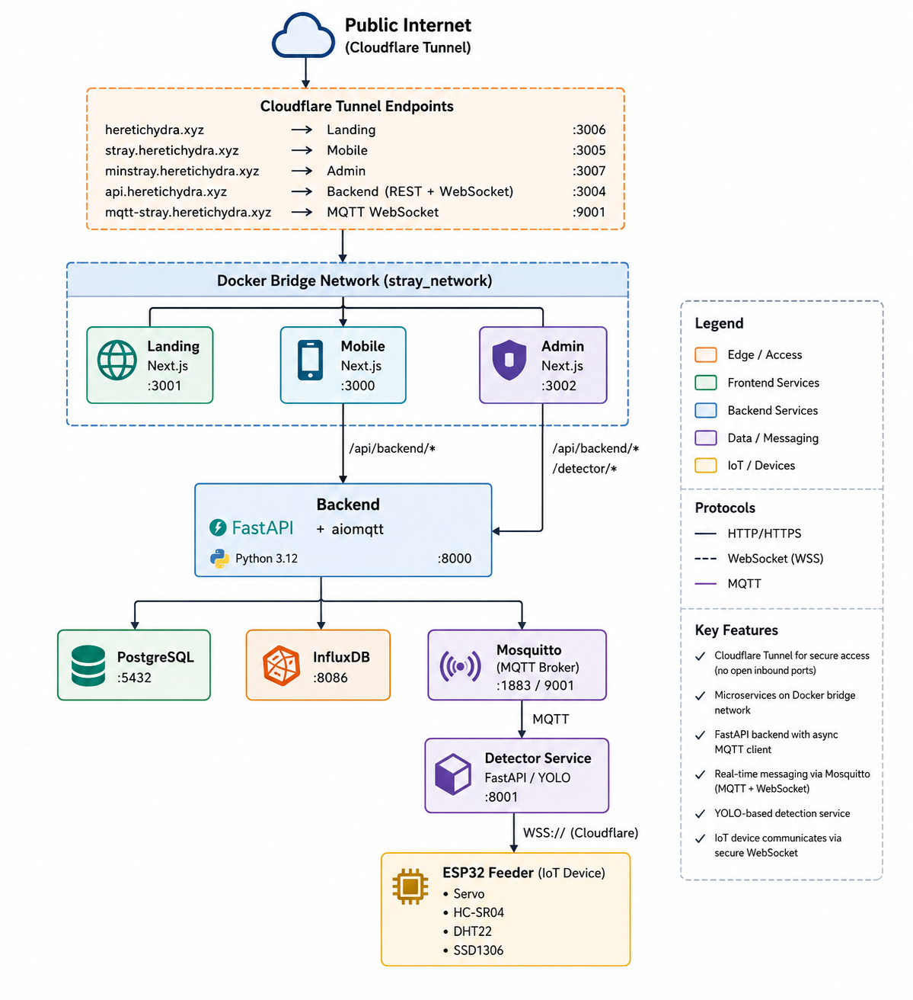

# Stray — Smart Stray-Cat Care Platform

**Stray** is a community-driven, crowdfunded cat-feeding network built at NTUST (National Taiwan University of Science and Technology). Automated feeders are deployed in public spaces across Taiwan. A citizen scans a QR code, pays NT$15–150, and the device dispenses food on-demand. A live YOLO camera feed shows the cat eating in real time.

---

## Documentation

| Component | Description |
|-----------|-------------|
| [Admin Dashboard](docs/admin.md) | Next.js 14 operator console — real-time map, YOLO feed, station controls |
| [IoT Firmware](docs/iot.md) | ESP32 C++ firmware — wiring, servo, sensors, MQTT over WebSocket-TLS |
| [Landing Page](docs/landing.md) | Public marketing site — live stats, how-it-works, station preview |
| [Mobile App](docs/mobile.md) | Citizen-facing PWA — station browser, donation flow, live detection |
| [Detector Service](docs/detector.md) | Python/FastAPI YOLO service — cat detection, ByteTrack, sliced inference |
| [Databases](docs/database.md) | PostgreSQL (relational state) + InfluxDB (time-series telemetry) |
| [MQTT Service](docs/mqtt.md) | Mosquitto broker — topic schema, ESP32 ↔ backend messaging |

---

## System architecture



---

## Quickstart

### Prerequisites

- Docker + Docker Compose
- Node.js 20+ and pnpm (for local frontend development)
- Python 3.11+ (for local service development)

### 1. Copy environment file

```bash
cp .env.example .env
# Edit .env — set production values for JWT_SECRET, INFLUX_TOKEN, etc.
```

### 2. Start the full stack

```bash
docker compose up --build
```

Services start in dependency order: databases → backend → frontends → detector.

| Service | Local URL |
|---------|-----------|
| Landing | http://localhost:3006 |
| Mobile | http://localhost:3005 |
| Admin | http://localhost:3007 |
| Backend API | http://localhost:3004 |
| Detector | http://localhost:3008 |
| InfluxDB UI | http://localhost:8086 |
| MQTT TCP | localhost:1883 |

### 3. Seed the database (optional)

```bash
docker compose exec backend python -m app.db.seed
```

### 4. Flash the ESP32

See [IoT Firmware docs](docs/iot.md) for PlatformIO setup and wiring.

---

## Monorepo layout

```
ntust-stray-main/
├── apps/
│   ├── admin/          # Next.js admin dashboard
│   ├── iot/            # ESP32 PlatformIO firmware
│   ├── landing/        # Next.js marketing site
│   └── mobile/         # Next.js mobile web app
├── backend/            # FastAPI backend
│   └── app/
│       ├── api/        # REST routers (stations, payments, auth, events…)
│       ├── core/       # Config, schemas, security
│       ├── db/         # SQLAlchemy models, sessions, migrations
│       ├── influx/     # InfluxDB writer + queries
│       ├── mqtt/       # MQTT client, handlers, publisher
│       ├── ws/         # WebSocket manager + router
│       └── scheduler.py
├── services/
│   └── detector/       # FastAPI YOLO detection service
├── packages/
│   └── ui/             # Shared TypeScript/React component library
├── mosquitto/          # Mosquitto config and data volumes
├── cloudflared/        # Cloudflare Tunnel config
├── docker-compose.yml
├── docker-compose.dev.yml
└── docs/               # This documentation
```

---

## Key data flows

### Telemetry (ESP32 → cloud → browser)

1. ESP32 publishes `stray/{code}/telemetry` every 10 s
2. Backend MQTT listener receives it, updates PostgreSQL `stations`, writes to InfluxDB `station_metrics`
3. Backend broadcasts a `telemetry` WebSocket event to all connected browsers
4. Mobile and Admin frontends update the UI in real time

### Donation → dispense

1. User selects a donation amount in the mobile app
2. `POST /api/backend/payments/sessions` → backend creates a `PaymentSession` and publishes `show_qr` to the station's OLED
3. ESP32 displays the payment QR code
4. User confirms payment → `POST /api/backend/payments/sessions/{id}/pay`
5. Backend marks session `paid`, creates `Donation` record, publishes `dispense` to the station
6. ESP32 turns the servo, dispenses food, then publishes `dispense/ack`
7. Backend writes a `feed_event` to InfluxDB and broadcasts a `feed_event` WebSocket event

### Button press → QR

1. Physical button pressed on feeder → ESP32 publishes `request_qr`
2. Backend creates a `PaymentSession` (NT$40 / 50g default) and publishes `show_qr`
3. ESP32 renders the payment URL as a QR code on the OLED

---

## Production deployment

The Cloudflare Tunnel (`cloudflared` Docker service) exposes all public services without opening inbound firewall ports. Configure it once:

```bash
cloudflared tunnel login
cloudflared tunnel create ntust-stray
# Add DNS routes (see cloudflared/config.yml for the full list)
```

Replace `<TUNNEL_ID>` in `cloudflared/config.yml` with the ID from `tunnel create`, then:

```bash
docker compose up -d
```

See [cloudflared/config.yml](cloudflared/config.yml) for the full hostname → service mapping.
